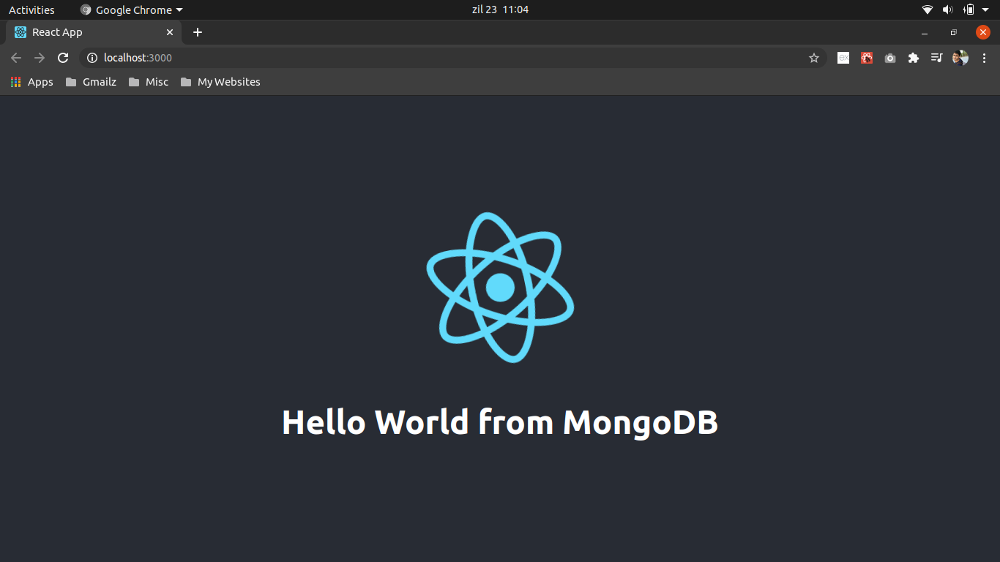

# FReMP Stack boilerplate



## Requirements
- Python3/Flask
- ReactJS
- MongoDB

## Clone & use
Add data in your MongoDB!
```
$ mongo
$ use fremp_test_app1_db
$ db.fremp_test_app1_col.insertOne({'data': 'Hello World from MongoDB'})
```

Clone the repository and install the app locally.
```
$ git clone https://github.com/FReMP/fremp
$ cd backend
$ python3 app.py
```
This will run the server locally at http://localhost:5000

```
$ cd ../frontend/
$ yarn start
```
To view the project now, open http://localhost:3000